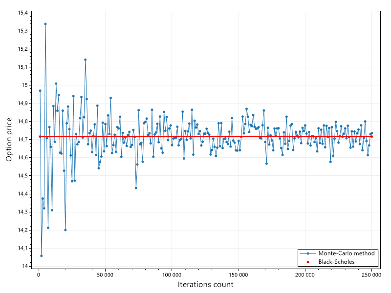
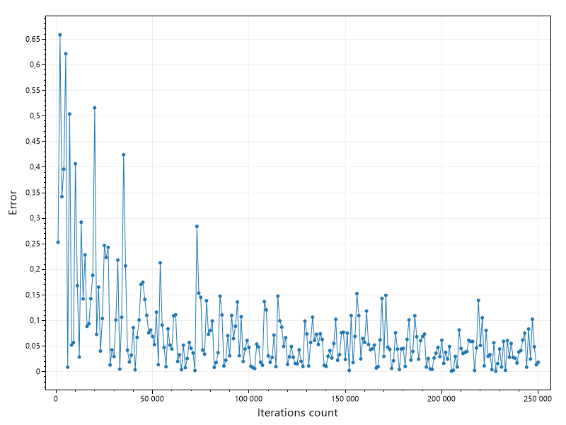

# Использование метода Монте-Карло для оценивания стоимости европейского опциона

Необходимо с помощью метода Монте-Карло оценить стоимость европейского опциона и сравнить со стоимостью, полученной по аналитической формуле Блэка-Шоулза.

## Формула Блэка-Шоулза

$$C = S_{0} N(d_1) - Ke^{-rT} N(d_{2})$$

$$d_{1} = \ln(\frac{S_{0}}{K}) + (r + \frac{\sigma^2}{2})T / (\sigma \sqrt(T))$$

$$d_{2} = d_{1} - \sigma \sqrt(T)$$

Здесь $S_{0}$ - цена актива в начальный момент времени, $K$ - страйк-цена, $r$ - безрисковая ставка, $\sigma$ - волатильность, T - остаток времени до истечения договора, $N(x)$ - функция стандартного нормального распределения.

## Метод Монте-Карло

$$S(T) = S_{0} \exp((r - \sigma^2 / 2)T + \sigma \sqrt(T)\varepsilon) \qquad (1)$$

$\varepsilon$ - случайная величина, имеющая стандартное нормальное распределение.

$$C = \max(S(T) - K, 0) \qquad (2)$$

Формальный алгоритм метода:

1. Генерация $n$ случайных нормально распределенных чисел $\varepsilon$ и вычисление для каждого из них цены актива $S(T)$ по формуле (1);
2. Нахождение для каждой найденной цены актива $S(T)$ цены опциона $C$ по формуле (2);
3. Вычисление среднего арифметического всех полученных цен опциона $C_{mid}$;
4. Вычисление дисконтированного среднего значения цены опциона по формуле $C = e^{-rT} C_{mid}$

## Графики

